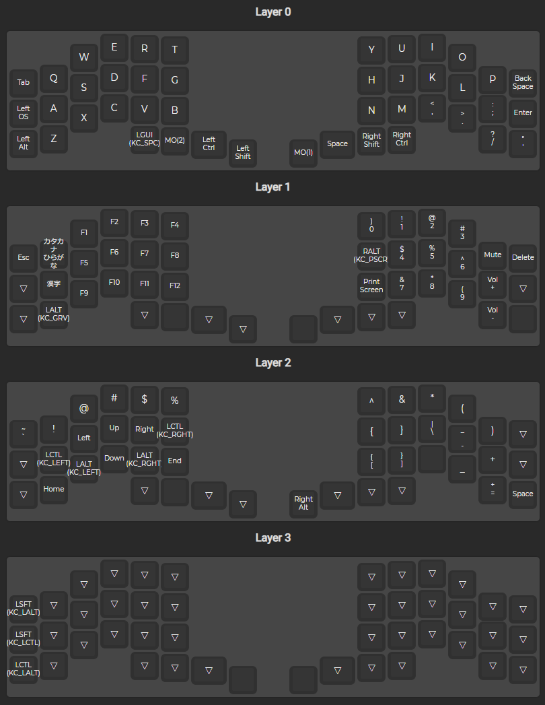

# claw44_keymap

This is my keymap of claw44.

buy here:https://yushakobo.jp/shop/consign_claw44-v2/

# My Keymap
has three layers.

# Used Tool

- QMK Configurator:https://config.qmk.fm/#/1upkeyboards/1up60hse/LAYOUT_60_ansi
- Firmware Writer:https://github.com/qmk/qmk_toolbox/releases
- reference:https://salicylic-acid3.hatenablog.com/entry/qmk-configurator